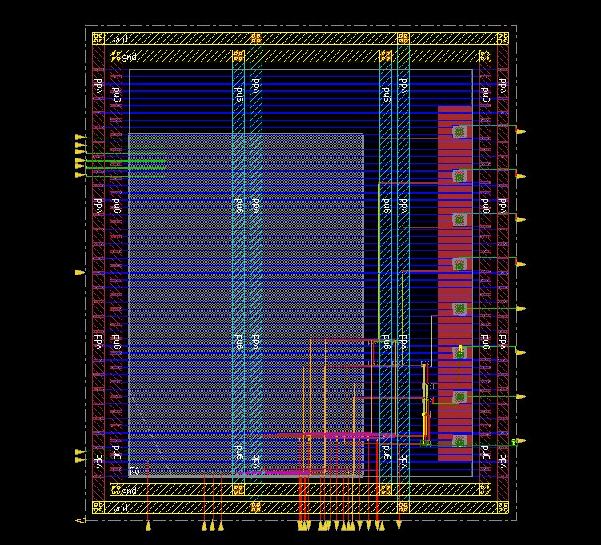

# OpenRAM_test
Some test config and code for OpenRAM


Open RAM generation
------------------

The sample script and output could be found in folder:
output_w8_b512_freepdk45

Following is a configuration for a typical/typical 512  words of 8 bit

```
word_size = 8
num_words = 512

# num_rw_ports = 1
# num_r_ports = 1
# num_w_ports = 0


tech_name = "freepdk45"
process_corners = ["TT"]
supply_voltages = [1.0]
temperatures = [25]

route_supplies = True
check_lvsdrc = False

output_path = "output_w{0}_b{1}_{2}".format(word_size,
                                        num_words,
                                        tech_name)
output_name = "sram_w{0}_b{1}_{2}".format(word_size,
                                        num_words,
                                        tech_name)

```


Library Compiler
---------------

To be used with DC_shell, we need to compile to db format using file syn/script/lc_scripts.tcl

```
read_lib ../output_w8_b512_freepdk45/sram_w8_b512_freepdk45_TT_1p0V_25C.lib
list_libs

write_lib  sram_w8_b512_freepdk45_TT_1p0V_25C_lib -format db -output ../output_w8_b512_freepdk45/sram_w8_b512_freepdk45_TT_1p0V_25C.db

exit

```

Synthesis and P&R
----

The synthesis and p&r script can be found in the folders named syn  and pnr


Sample layout
----


